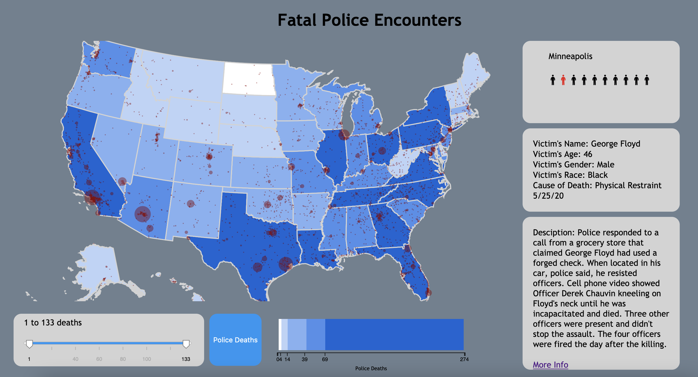

# US Police Encounters Data Visualization

## Description
This project allows a user to explore data collected from fatal encounters with law enforcement. We used D3.js to create a data visualization
where a user can zoom and pan a map populated with fatal encounters by city, click on individuals and learn the specific context of their death
and toggle a choropleth with police deaths. A user can also filter cities by number of deaths in order to narrow his/her search. We have made
detailed information available for each victim, including: name, age, gender, race, cause of death, a description of the encounter, and a link
to more information.
